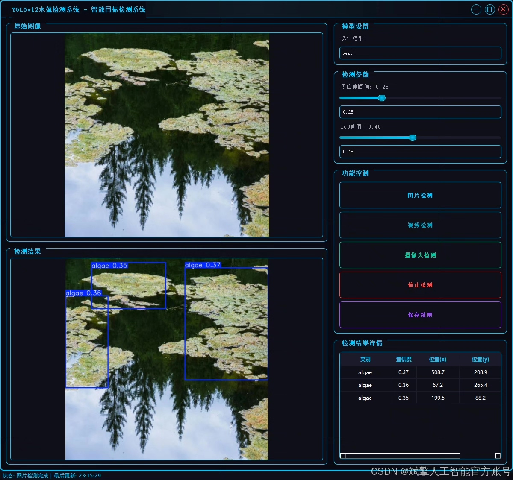
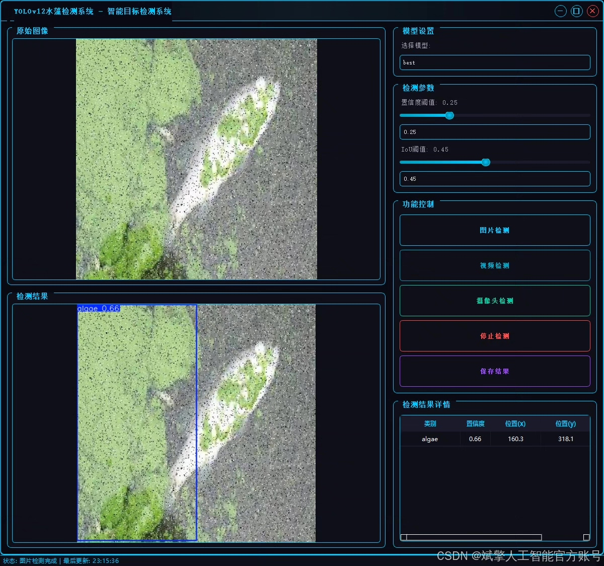
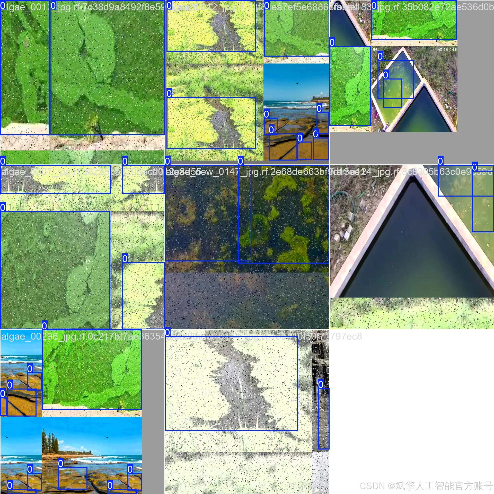
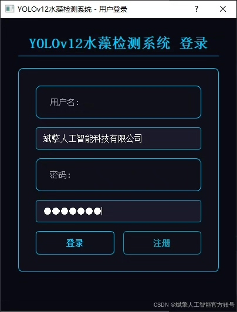
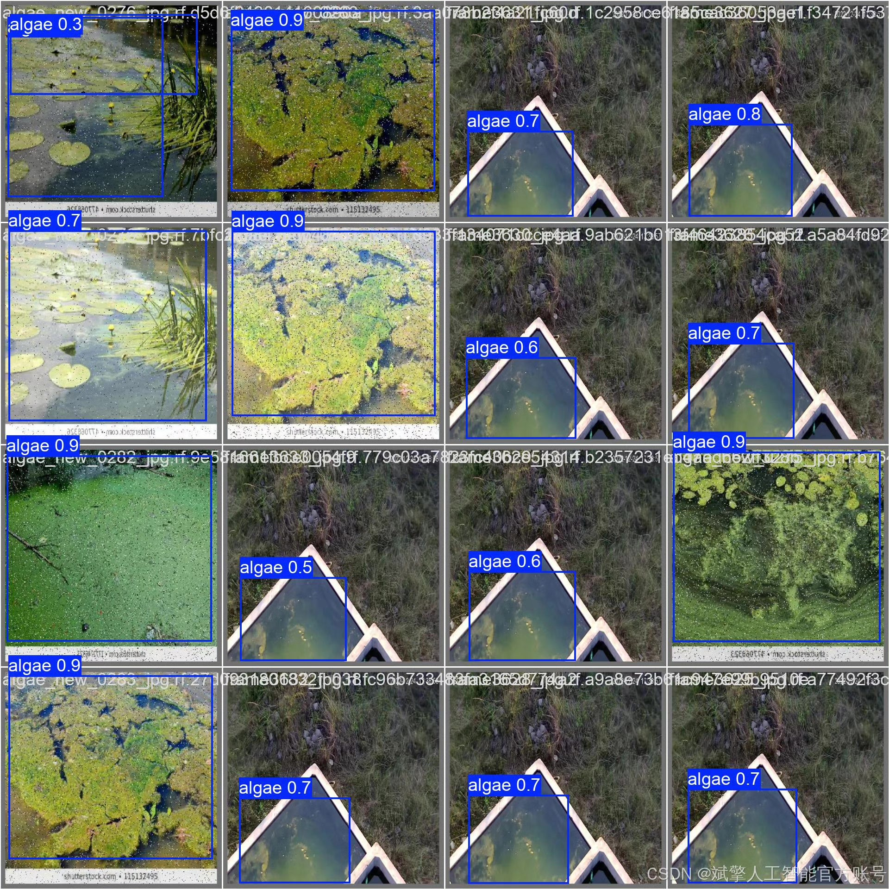
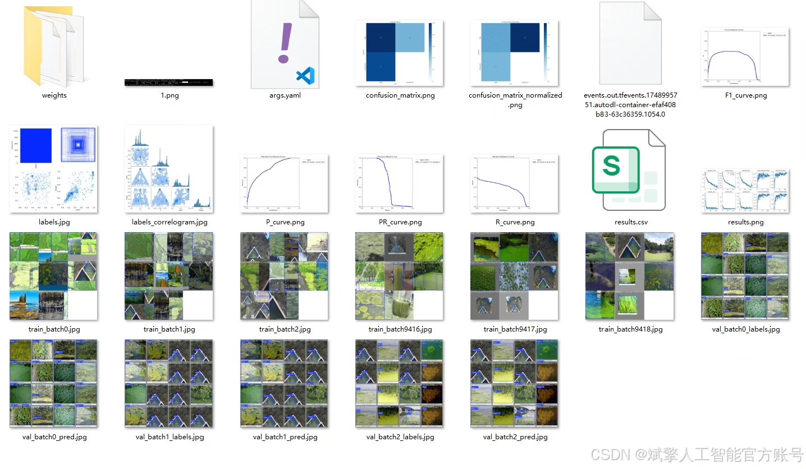
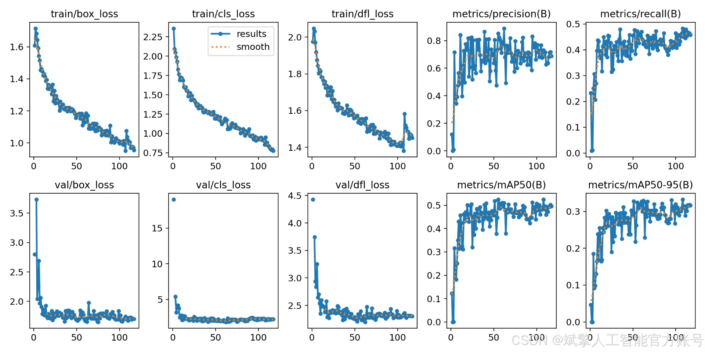

# YOLOv12 Aquatic Algae Detection System

## Body

The YOLOv12 Aquatic Algae Detection System, based on deep learning techniques, proposes a rapid detection and monitoring system for aquatic algae. This system is crucial for environmental protection and water quality management due to the increasing issue of eutrophication in water bodies. The system utilizes the YOLOv12 algorithm and incorporates a custom dataset consisting of 704 training images and 344 validation images to train the model, achieving precise detection of single-class (aquatic algae) targets. Additionally, the system features a user-friendly UI interface with login and registration capabilities. Experimental results demonstrate that the system performs exceptionally well in terms of detection accuracy and real-time performance, offering an intelligent solution for aquatic algae monitoring.
✅ User Login & Registration: Supports password verification and security authentication.
✅ Three Detection Modes: Based on the YOLOv12 model, supports image, video, and real-time camera detection, accurately identifying targets.
✅ Dual-Screen Comparison: Displays the original scene and detection results simultaneously on the same screen.
✅ Data Visualization: Real-time table displays the category, confidence, and coordinates of detected targets.
✅ Intelligent Parameter Tuning: Offers a confidence slide bar to dynamically optimize detection accuracy, adapting to different scene requirements.
✅ Sci-Fi Interactive Interface: Dark theme paired with dynamic light effects reduces visual fatigue and enhances operational experience.

## Images

## Payment

Here is a pay link on Stripe ( https://buy.stripe.com/3cs8yP7sY87d0vu9AB ). Please contact me lonlonago@foxmail.com after funding $89, and I will send you a complete data files , thank you!

